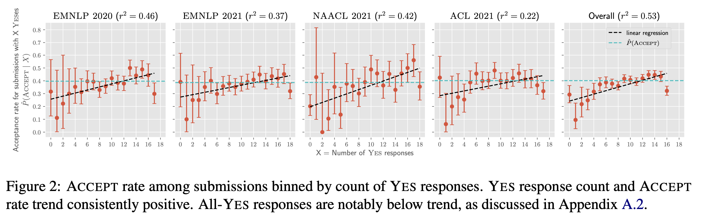
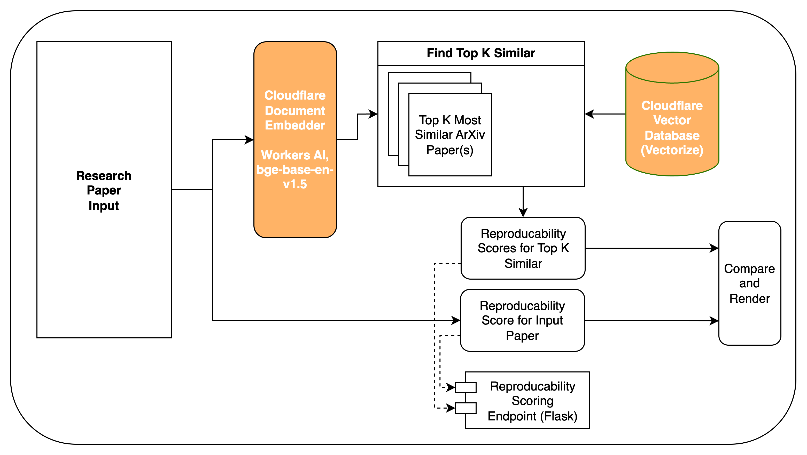
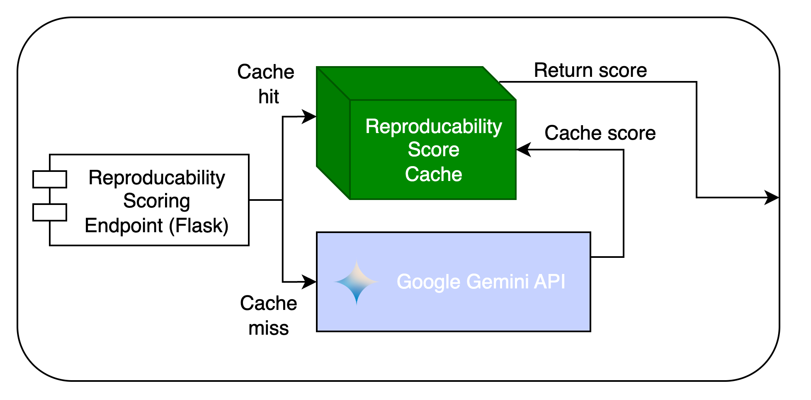

# VeriXiv
VeriXiv (Verify x ArXiv, pronounced Veri-kive) is a scalable and efficient research paper verifier that checks for reproducability of your paper against semantically similar papers in your research domain. 

## Motivation
A study in 2023 by [Magnusson et. al.](https://arxiv.org/pdf/2306.09562) in "Reproducibility in NLP: What Have We Learned from the Checklist?" conducted an empirical study on the effects of reproducability of results of a paper with acceptance into reputable ML (NLP) conferences such as EMNLP.

In particular, they found that there existed a correlation between number of "Yes" marks in a rubric with acceptance to the conference. 

## VeriXiv Implementation
We used the same rubric and few shot prompted a strong Large Language Model to read an input paper and score the reproducability of the paper based on the rubric.

Our system then embeds the abstract of the paper and finds the top **k** most semantically similar papers and compares the input paper's reproducability against it.

The intuition is that semantically similar papers likely involve the same or similar research area, and having this scoring mechanism for reproducability helps maintain both a status quo as well as a baseline to see how well your paper compares in terms of being able to be reimplemented compared to other papers.

The main technologies used were:

1. Cloudflare Workers AI, (Embedding model, bge-base-en-v1.5 model)
2. Cloudflare Vectorize (Vector Database)
3. Google Gemini API, 2.5 Flash, 2.5 Pro
4. Flask (API Endpoint for Scoring)
5. SQLite (Caching)

### Pipeline
The below image is the high level pipeline for our system.

### Scoring Endpoint
The below image shows the high level scoring endpoint that is called to produce reproducability scores for the top-k semantically similar papers as well as the input papers. For ArXiv papers, we cache these reproducability scores against the ArXiv ID, such that we do not have to use extraneous tokens reproducing previously generated scores.

